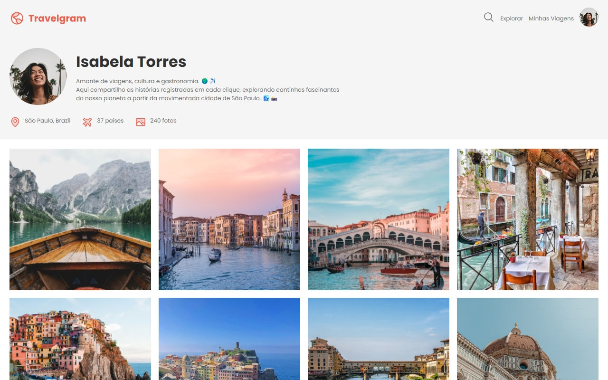
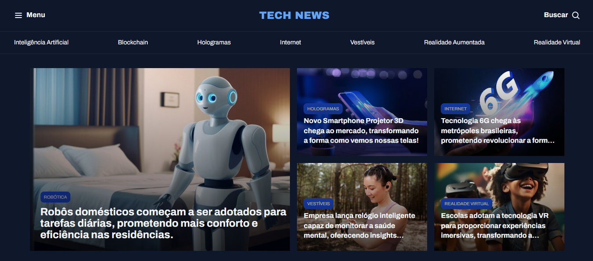
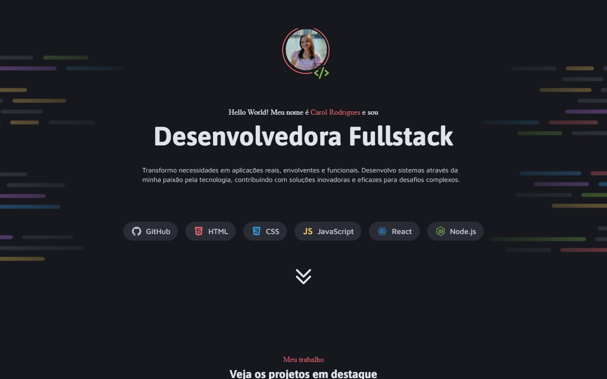
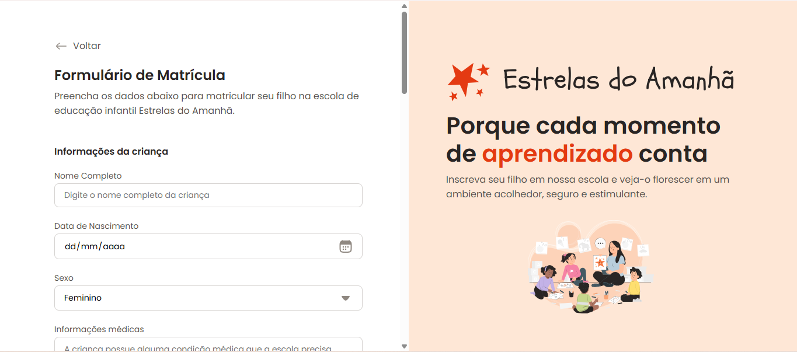
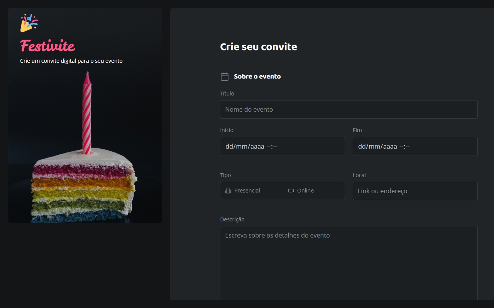
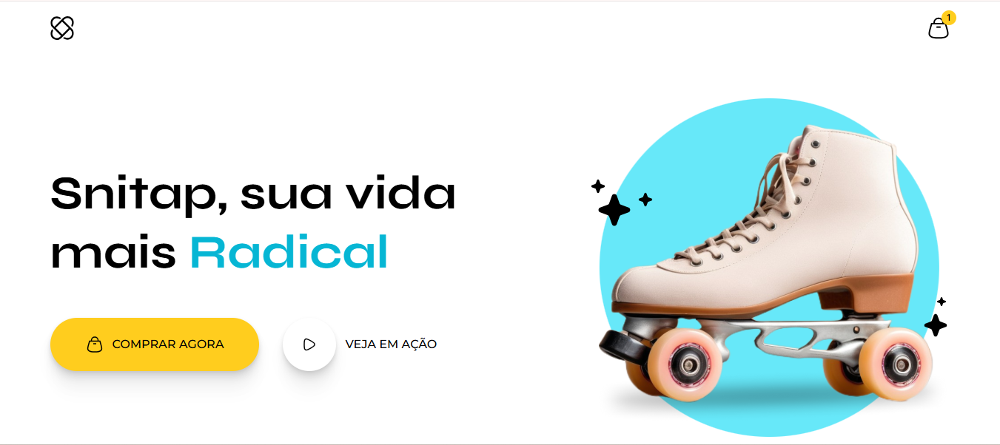

<div align="center">

# 🎨 HTML & CSS — Projetos de Interface

**Do layout ao produto: 8 projetos, cada um focado em uma habilidade que faz diferença em interfaces reais.**


</div>

---

## 👋 Sobre este repositório

Reúne os projetos de **HTML e CSS** que desenvolvi na formação Full Stack da [Rocketseat](https://www.rocketseat.com.br/).
Cada projeto foi pensado para praticar uma habilidade específica de front-end, e **todos são responsivos e estão publicados online** — é só clicar em **Ver online**.

---

## 🧭 Habilidades e por que elas importam

| Habilidade | O que eu pratiquei | Por que faz diferença em um produto digital |
|---|---|---|
| **HTML semântico** | Estrutura com as tags certas para cada conteúdo | Melhora acessibilidade, SEO e facilita a manutenção do código por outras pessoas |
| **Flexbox** | Alinhamento e distribuição de elementos em uma dimensão | Interfaces consistentes e componentes que se adaptam ao conteúdo |
| **Grid** | Layouts em duas dimensões (linhas e colunas) | Páginas complexas organizadas sem gambiarras e mais fiéis ao design |
| **Formulários** | Campos, labels, tipos de input e validação nativa | É onde o usuário converte (cadastro, matrícula, contato): formulário claro e acessível reduz abandono |
| **Responsividade** | Media queries e unidades relativas | Grande parte dos acessos vem do celular; a mesma experiência precisa funcionar em qualquer tela |
| **Animações e transições** | Transições, keyframes e feedback visual | Guiam a atenção, dão retorno às ações do usuário e aumentam a percepção de qualidade |

---

## 🚀 Projetos

### 01 · Travelgram — Layout de viagens
[](https://carolrodrigues14.github.io/html-css-projetos-interface/HTML-CSS/01-Travelgram/)

Layout de viagens construído com foco em estrutura e alinhamento.

**Habilidades:** HTML semântico · Flexbox
🔗 [Ver online](https://carolrodrigues14.github.io/html-css-projetos-interface/HTML-CSS/01-Travelgram/) · 💻 [Código](./HTML-CSS/01-Travelgram)

---

### 02 · Portal de Notícias
[](https://carolrodrigues14.github.io/html-css-projetos-interface/HTML-CSS/02-PortalNoticias/)

Página de notícias com hierarquia de conteúdo e organização em colunas.

**Habilidades:** HTML semântico · Grid
🔗 [Ver online](https://carolrodrigues14.github.io/html-css-projetos-interface/HTML-CSS/02-PortalNoticias/) · 💻 [Código](./HTML-CSS/02-PortalNoticias)

---

### 03 · Portfólio Dev
[](https://carolrodrigues14.github.io/html-css-projetos-interface/HTML-CSS/03-PortfolioDev/)

Página de portfólio pessoal combinando as técnicas de layout aprendidas até aqui.

**Habilidades:** Flexbox · Grid · Composição de layout
🔗 [Ver online](https://carolrodrigues14.github.io/html-css-projetos-interface/HTML-CSS/03-PortfolioDev/) · 💻 [Código](./HTML-CSS/03-PortfolioDev)

---

### 04 · Formulário de Matrícula
[](https://carolrodrigues14.github.io/html-css-projetos-interface/HTML-CSS/04-FormularioMatricula/)

Formulário de matrícula com campos agrupados, labels e tipos de input adequados.

**Habilidades:** Formulários · Validação nativa · Acessibilidade
🔗 [Ver online](https://carolrodrigues14.github.io/html-css-projetos-interface/HTML-CSS/04-FormularioMatricula/) · 💻 [Código](./HTML-CSS/04-FormularioMatricula)

---

### 05 · Formulário de Convite
[](https://carolrodrigues14.github.io/html-css-projetos-interface/HTML-CSS/05-FormularioConvite/)

Formulário de convite com layout dividido entre imagem e formulário.

**Habilidades:** Formulários · Flexbox · Grid
🔗 [Ver online](https://carolrodrigues14.github.io/html-css-projetos-interface/HTML-CSS/05-FormularioConvite/) · 💻 [Código](./HTML-CSS/05-FormularioConvite)

---

### 06 · Landing Page de Produto
[](https://carolrodrigues14.github.io/html-css-projetos-interface/HTML-CSS/06-LandingPage/)

Landing page que se adapta de desktop a mobile.

**Habilidades:** Responsividade · Media queries · Unidades relativas
🔗 [Ver online](https://carolrodrigues14.github.io/html-css-projetos-interface/HTML-CSS/06-LandingPage/) · 💻 [Código](./HTML-CSS/06-LandingPage)

---

### 07 · Landing Page Patins Animada
[](https://carolrodrigues14.github.io/html-css-projetos-interface/HTML-CSS/07-LandingPagePatinsAnimada/)

Landing page com animações e transições que dão vida à interface.

**Habilidades:** Animações · Transições · Keyframes
🔗 [Ver online](https://carolrodrigues14.github.io/html-css-projetos-interface/HTML-CSS/07-LandingPagePatinsAnimada/) · 💻 [Código](./HTML-CSS/07-LandingPagePatinsAnimada)

---

<!-- TODO: adicionar o 8º projeto aqui, copiando o modelo acima -->

## 🛠️ Como visualizar

Cada projeto está publicado no **GitHub Pages** (link em *Ver online*). Para rodar localmente:

```bash
git clone https://github.com/CarolRodrigues14/rocketseat-fullstack.git
cd rocketseat-fullstack/HTML-CSS/01-Travelgram
# abra o index.html no navegador
```

Cada pasta tem seu próprio README com mais detalhes do projeto.

---

## 📬 Contato

**Caroline Rodrigues** · Desenvolvedora Front-end Jr

[](https://linkedin.com/in/carolinerodrigues14)
[](https://github.com/CarolRodrigues14)

---

<div align="center">

Licença [MIT](./LICENSE)

</div>
